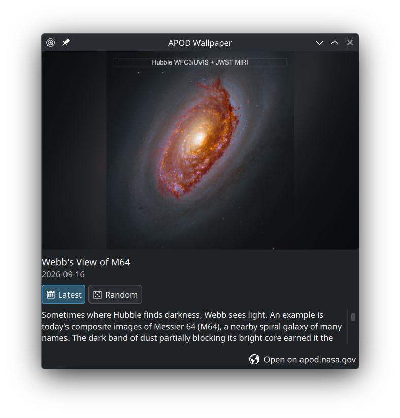

# kde-apod

NASA's [Astronomy Picture of the Day](https://science.nasa.gov/apod/) as your KDE Plasma 6 wallpaper, fitted to every monitor, with a panel widget to switch between today's picture and random ones from the archive.



## Features

- **Daily wallpaper.** A new picture every morning at 07:00, and at login if the computer was off. On days when APOD is a video, the most recent photo stays.
- **Fitted to each monitor.** Every screen gets its own copy at its native resolution. If the picture's shape is close to the screen's, it is cropped to fill the screen. If the shapes are very different (a portrait photo on an ultrawide, say), the whole picture is shown over a blurred copy of itself.
- **Monitor changes.** Plugging in or unplugging a monitor re-fits the wallpaper right away.
- **Lock screen** uses the same picture.
- **Notification** with the picture's title, credit and NASA's explanation when the picture changes.
- **Panel widget** with a thumbnail, the explanation, and a link to the APOD page:
  - **Latest:** NASA's new picture every day.
  - **Random:** a random picture from the archive every day, plus a **Shuffle** button for another one right away.

## Requirements

- KDE Plasma 6 (Wayland or X11) with systemd
- ImageMagick, jq, curl and notify-send:

| Distro | Command |
|---|---|
| Fedora | `sudo dnf install ImageMagick jq curl libnotify` |
| Arch / Manjaro | `sudo pacman -S --needed imagemagick jq curl libnotify` |
| Debian / Ubuntu / KDE neon | `sudo apt install imagemagick jq curl libnotify-bin` |
| openSUSE | `sudo zypper install ImageMagick jq curl libnotify-tools` |

## Install

```sh
git clone https://github.com/smolamSK/kde-apod.git
cd kde-apod
./install.sh --api-key YOUR_NASA_KEY --add-to-panel
```

Everything is installed for your user only, so no `sudo` is needed. The wallpaper changes as soon as the install finishes.

**Get a free NASA API key** at https://api.nasa.gov (the key is shown immediately after signing up). Without one, the shared `DEMO_KEY` is used. It is limited per IP address and runs out quickly, especially when using Random.

Without `--add-to-panel`, add the widget yourself: right-click the panel → **Add Widgets…** → search for **APOD Wallpaper**.

## Update

```sh
cd kde-apod
git pull
./install.sh
```

Your settings are kept.

## Configuration

Settings are in `~/.config/apod-wallpaper.conf`:

| Setting | Default | Meaning |
|---|---|---|
| `API_KEY` | `DEMO_KEY` | NASA API key, letters and digits only, as issued by api.nasa.gov. `apod-wallpaper help` shows whether the shared `DEMO_KEY` or a personal key is in use. |
| `FIT_THRESHOLD` | `1.2` | How different the picture and screen shapes may be before the picture is shown whole over a blurred background instead of cropped. `1.2` crops away at most about 17%. |
| `RANDOM_SINCE` | `2007-01-01` | Random mode only picks pictures from this date on. Older ones are mostly small. |
| `RANDOM_MIN_SIZE` | `1920` | Random mode skips pictures whose longer side is smaller than this many pixels. |
| `KEEP_DAYS` | `7` | Downloaded pictures older than this are deleted. |

To change the daily time, run `systemctl --user edit apod-wallpaper.timer` and override `OnCalendar=`.

## Command line

```
apod-wallpaper update [--date YYYY-MM-DD]  daily run: newest picture, or a random one in random mode
apod-wallpaper latest                      switch to latest mode and show today's picture
apod-wallpaper random                      switch to random mode and show a random archive picture
apod-wallpaper apply  [--image PATH]       re-fit the current image to the current monitors
apod-wallpaper notify                      show the current picture's title again
apod-wallpaper status                      current picture and mode as JSON
apod-wallpaper help                        these commands, plus whether DEMO_KEY or a personal key is used
```

## Uninstall

```sh
./uninstall.sh           # keeps settings and downloaded pictures
./uninstall.sh --purge   # removes those too
```

Your wallpaper stays as it is until you choose another one.

## How it works

| Part | Installed to |
|---|---|
| Script | `~/.local/bin/apod-wallpaper` |
| Daily run (07:00 and at login) | `apod-wallpaper.timer` and `apod-wallpaper.service` (systemd user units) |
| Monitor watcher (listens for display hotplug events from udev) | `apod-wallpaper-watch.service` |
| Panel widget | `~/.local/share/plasma/plasmoids/io.github.smolamsk.apodwallpaper` |
| Downloaded pictures, per-monitor copies, current mode | `~/.local/share/apod-wallpaper/` |

Monitor sizes come from `kscreen-doctor`. The wallpaper is set per desktop through Plasma's scripting interface, and the lock screen through `kscreenlockerrc`.

## Troubleshooting

- **See what happened:** `journalctl --user -u apod-wallpaper -u apod-wallpaper-watch`
- **"NASA API rate limit reached":** you're using `DEMO_KEY`. Get a free key and run `./install.sh --api-key YOUR_KEY`.
- **Wrong fit after changing a monitor's resolution or rotation:** run `apod-wallpaper apply`. Only plugging and unplugging monitors is detected automatically.

## License

GPL-2.0-or-later. Pictures are © their respective authors, as credited on APOD.
